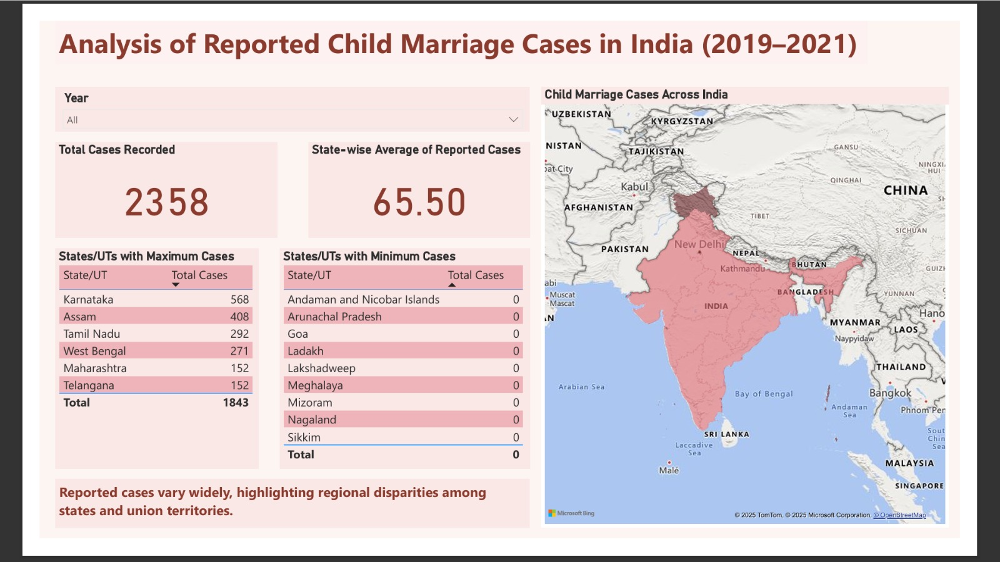
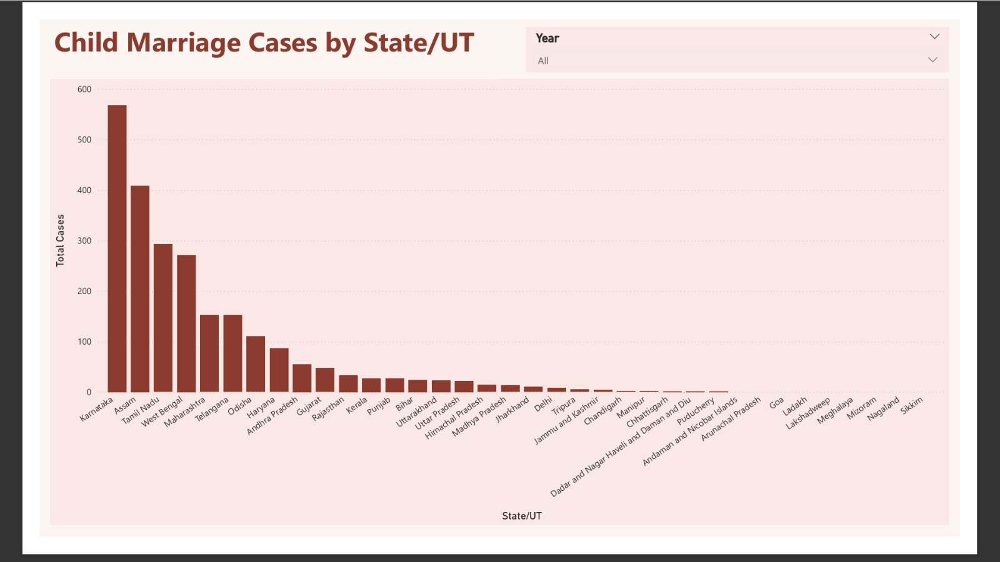
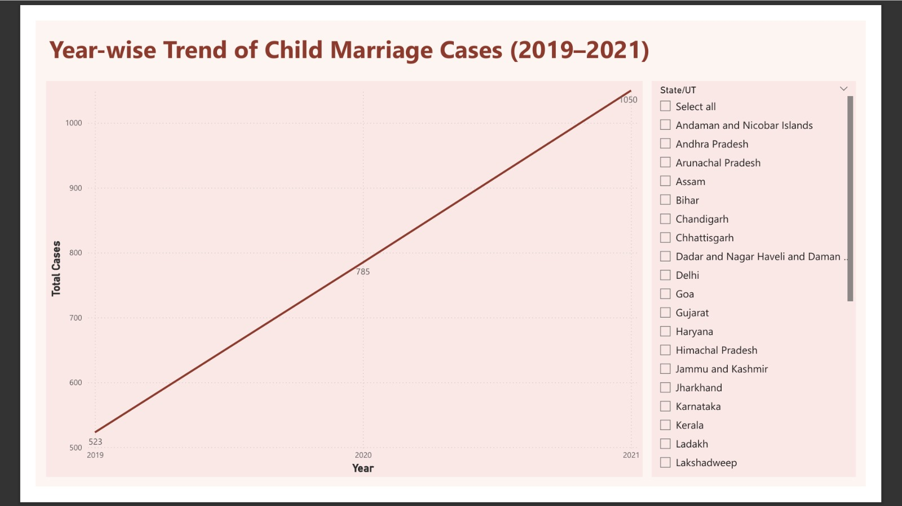

# Child Marriage Report (India, 2019–2021)

An interactive Power BI report analyzing child marriage cases across Indian states and union territories from 2019 to 2021.

## Report Highlights

- **Top 5 and Bottom 5 regions** based on reported cases
- **Interactive slicers**:
  - **Year slicer** on pages 1 & 2
  - **State/UT slicer** on page 3
- **Cards** showing total cases and state-wise averages
- **Map visual** to illustrate regional distribution
- **State-wise/UT-wise total child marriage cases**
- **Line chart** visualizing yearly trends

## Insight

> Significant disparity can be observed between states/UTs with maximum and minimum reported cases.

## Preview

